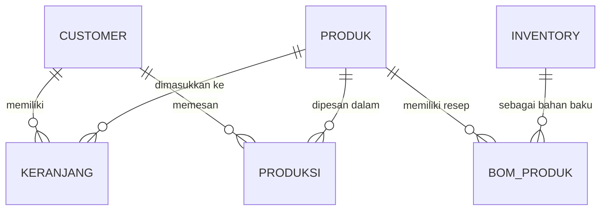
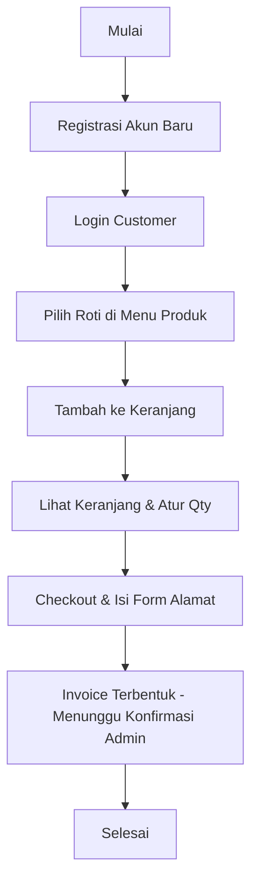
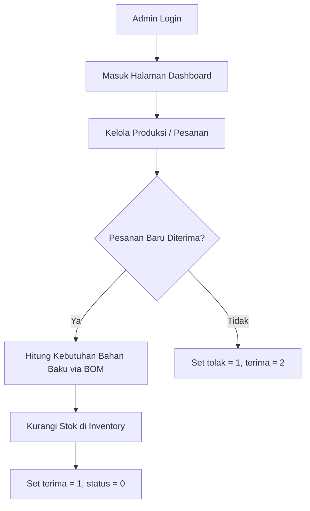

# DOKUMENTASI SISTEM: APLIKASI TOKO ROTI (TOKO-ROTI)

Dokumen ini ditujukan untuk developer (terutama pemula) agar dapat mempelajari, memahami, dan memodifikasi sistem website toko roti **TOKO-ROTI** yang telah dimigrasikan ke framework Laravel.

---

## 1. Pendahuluan & Arsitektur Sistem

Aplikasi ini menggunakan pola arsitektur **MVC (Model-View-Controller)** yang disediakan oleh Laravel:
- **Model**: Mengelola data dan logika bisnis (berinteraksi dengan database).
- **View**: Mengelola tampilan antarmuka (User Interface) menggunakan engine template **Blade Laravel**.
- **Controller**: Jembatan pengantara yang menerima input pengguna, berinteraksi dengan Model, dan mengembalikan View yang sesuai.

Sistem dibagi menjadi dua bagian besar:
1. **Front-End Pelanggan (Customer)**: Tempat pengunjung mendaftar, login, melihat produk roti, memasukkan roti ke keranjang belanja, dan melakukan checkout pesanan.
2. **Back-End Admin (Admin Panel)**: Tempat pemilik/pengelola toko roti memvalidasi pesanan, mengelola stok bahan baku, resep pembuatan roti (BOM), dan melihat laporan keuangan.

---

## 2. Struktur Database (`db_toko`)

Tabel-tabel di database saling berhubungan untuk mendukung proses pemesanan dan manajemen bahan baku:



### Penjelasan Tabel Utama:
1. **`customer`**: Menyimpan data akun pembeli. Primary key berupa string kustom (misal: `C0001`, `C0002`).
2. **`produk`**: Menyimpan daftar roti yang dijual beserta foto, deskripsi, dan harga.
3. **`keranjang`**: Tabel sementara untuk menampung produk yang ingin dibeli pelanggan sebelum checkout.
4. **`produksi`**: Tabel transaksi utama. Menyimpan data invoice pesanan, alamat kirim, status pengiriman, serta status apakah pesanan diterima (`terima = 1`) atau ditolak (`tolak = 1`).
5. **`inventory`**: Menyimpan data bahan baku (misal: Tepung, Keju, Cokelat) beserta jumlah stok (`qty`).
6. **`bom_produk`** (Bill of Materials): Menyimpan resep roti. Menghubungkan produk dengan bahan baku serta menentukan jumlah (`kebutuhan`) bahan baku yang diperlukan untuk membuat 1 buah roti tersebut.
7. **`admin`**: Menyimpan data akun pengelola toko untuk login ke admin panel.

---

## 3. Alur Kerja Aplikasi (Application Workflows)

### A. Alur Kerja Pelanggan (Customer Flow)



1. **Registrasi & Login**: Pengguna mendaftar dengan email dan nomor telepon. Sandi dienkripsi menggunakan `bcrypt`. Sistem login menyimpan data kode customer (`kd_cs`) dan nama dalam session Laravel.
2. **Pemesanan**: Pelanggan memilih produk dan kuantitasnya. Sistem akan memasukkan item ke tabel `keranjang`.
3. **Checkout**: Pelanggan mengisi alamat, kota, provinsi, dan kode pos. Setelah menekan tombol checkout, seluruh item di tabel `keranjang` akan dipindahkan ke tabel `produksi` dengan status `"Pesanan Baru"`, dan tabel `keranjang` dikosongkan.

---

### B. Alur Kerja Admin & Mekanisme Pengurangan Bahan Baku (BOM)

Bagian ini adalah jantung dari pengelolaan operasional toko roti.



#### Cara Kerja Pengurangan Bahan Baku Otomatis (Logika BOM):
Ketika admin menekan tombol **Terima Pesanan** (pada rute `admin/produksi/terima`):
1. Sistem mencari baris pesanan tersebut di tabel `produksi` berdasarkan kode invoice.
2. Untuk setiap produk dalam pesanan, sistem mencari resepnya di tabel `bom_produk` berdasarkan `kode_produk`.
3. Sistem mengambil data bahan baku (`kode_bk`) yang dibutuhkan beserta jumlah kebutuhannya (`kebutuhan`).
4. Formula perhitungan pengurangan stok:
   $$\text{Stok Baru} = \text{Stok Inventory Saat Ini} - (\text{Kebutuhan Resep} \times \text{Jumlah Roti yang Dipesan})$$
5. Sistem memperbarui data stok di tabel `inventory` dan mengubah status transaksi di tabel `produksi` menjadi **Diterima**.

---

## 4. Struktur Folder Proyek Laravel (TOKO-ROTI)

Bagi developer pemula, berikut adalah lokasi file penting yang akan sering Anda ubah:

- **`routes/web.php`**: Berkas utama untuk mendaftarkan semua alamat URL (Rute) website.
- **`app/Http/Controllers/`**: Folder yang berisi logika pemrosesan data.
  - `HomeController.php`: Mengontrol halaman beranda, tentang kami, dll.
  - `ProductController.php`: Mengontrol halaman produk pelanggan.
  - `CartController.php` & `CheckoutController.php`: Mengontrol keranjang dan transaksi pelanggan.
  - `AuthController.php`: Mengontrol registrasi dan login pelanggan.
  - `Admin/`: Folder khusus controller panel admin (Dashboard, Kelola Produk, Stok, Produksi, dan Laporan).
- **`app/Models/`**: Berisi file representasi tabel database. Jika Anda ingin menambah kolom baru di database, Anda mendaftarkannya di properti `$fillable` dalam Model yang bersangkutan.
- **`resources/views/`**: Folder template tampilan (HTML + CSS).
  - `layouts/`: Berisi template dasar menu atas (header) dan menu bawah (footer).
  - `admin/`: Folder halaman khusus untuk admin.
  - File berakhiran `.blade.php` adalah file HTML dinamis Laravel.
- **`public/`**: Folder untuk meletakkan file gambar (`image/`), file gaya (`css/`), dan file skrip interaktif (`js/`).

---

## 5. Panduan Modifikasi Sistem untuk Pemula

### A. Cara Menambahkan Halaman Baru
1. Buka berkas `routes/web.php`, tambahkan rute baru:
   ```php
   Route::get('/kontak', [HomeController::class, 'kontak']);
   ```
2. Buka controller `app/Http/Controllers/HomeController.php`, tambahkan fungsi `kontak`:
   ```php
   public function kontak() {
       return view('kontak'); // mengarah ke kontak.blade.php
   }
   ```
3. Buat file baru bernama `kontak.blade.php` di dalam folder `resources/views/` dan gunakan layout dasar pelanggan:
   ```html
   @extends('layouts.app')
   @section('content')
       <div class="container">
           <h2>Hubungi Kami</h2>
           <p>Nomor telepon: +6287804616097</p>
       </div>
   @endsection
   ```

### B. Cara Mengubah Resep Roti (BOM)
Resep dikelola melalui database pada tabel `bom_produk`.
Jika Roti Sobek (`P0001`) membutuhkan Tepung (`M0001`) sebanyak 5 kg (sebelumnya 4 kg):
1. Anda cukup memperbarui baris data pada tabel `bom_produk` di mana `kode_produk = 'P0001'` dan `kode_bk = 'M0001'`.
2. Ubah nilai kolom `kebutuhan` menjadi `5`.
3. Secara otomatis, kalkulasi pengurangan stok saat admin menekan tombol terima pesanan akan mengalikan jumlah pesanan dengan `5`.
